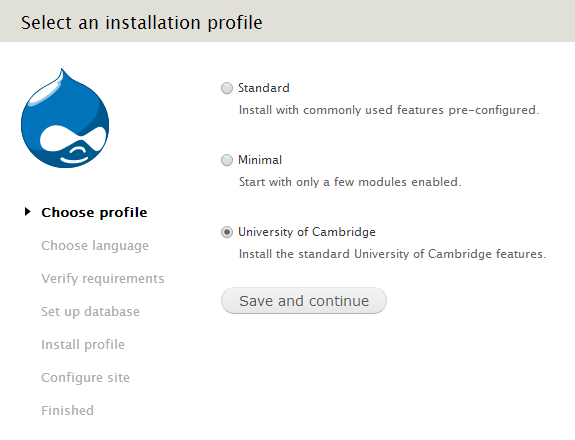

University of Cambridge install profile
=======================================

This install profile contains everything required for a University of Cambridge Drupal site (such as the University's house style and Raven authentication), and includes a variety of modules commonly used (such as Workbench, Media and CKEditor). Some modules are pre-configured, others are bundled; important patches are also applied to some modules where there hasn't been a new stable release.

Installing a new Drupal site
----------------------------

In a fresh copy of Drupal extract the contents of this profile to `/profiles/cambridge/`, then follow the normal Drupal installation process. On the first screen you will see the option to use the Cambridge install profile:

(If you have an existing site, presumably using one of Drupal's bundled install profiles, and would like to switch to this install profile, you can [Google how to do it](https://www.google.co.uk/search?q=drupal+switching+install+profiles). It won't configure the site, but can be useful if you would like to use the modules provided by the profile.)

Updating the profile
--------------------

New versions of the profile will be released every couple of months (sooner if there are security fixes), containing updates to modules (including patches), as well as new modules/functionality.

When updating the profile, replace the whole contents of the `/profiles/cambridge/` folder then run Drupal's update process.

You shouldn't normally make changes to the `/profiles/cambridge/` folder (including trying to updates profile-provided modules through Drupal's update manager), as you may run into problems trying to update the profile in the future.

If you do need a different version of a module to what the profile provides, however, you can override it by placing your version in your site's folder (so one of `/sites/all/modules/`, `/sites/default/modules/` or `/sites/www.mysite.cam.ac.uk/modules/`). When the profile is updated to include the new version you should then remove your override and let Drupal revert back to using the profile's version.
