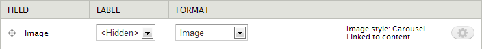

Drupal 7 University of Cambridge carousel feature
=================================================

The feature adds a node view mode for carousel items.

For each content type you will need to set the display settings for Carousel as follows:

If you are using a `field_link` provided by the [Link feature](https://github.com/misd-service-development/drupal-feature-link) you also need to make your link field available (it doesn't matter what format setting you use). The carousel item will then link to your custom URL rather than to the node.

Creating carousels
------------------

To create a carousel produced by a view, have a block with the following format options:

Then change the format settings to:

Finally, set CSS class in the Advanced section to:

The view block then needs to be set to appear in the 'Carousel' region.
