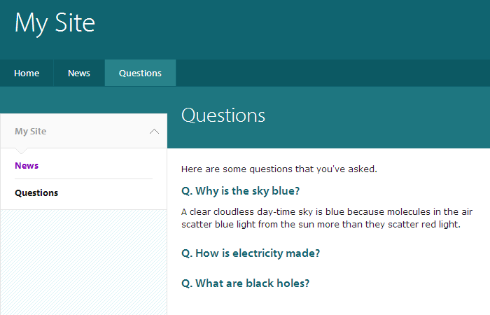

Drupal 7 University of Cambridge questions and answers feature
==============================================================

This feature adds a simple 'questions and answers' content type, where clicking/tapping on a question reveals the answer:

