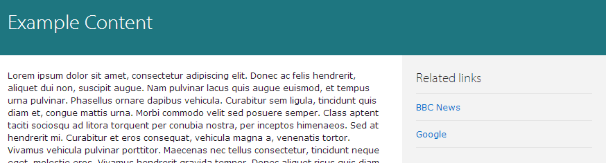

Drupal 7 University of Cambridge related links feature
======================================================

This feature adds a `field_related_links` base link field, which allows the user to add related links to a node, and also a view which then displays these in the sidebar.

Once you have added the field to a content type, make sure that it is set to hidden in each of the displays. The view block will then appear as follows on nodes that a) have the field, and b) have entries.

