Drupal 7 University of Cambridge teasers feature
================================================

This feature adds node view modes for horizontal, vertical, sidebar and focus on teasers, as well as for news listing items. (The horizontal teaser actually replaces Drupal's default teaser.)

To have an image appear in the teaser use the `field_image` base image field provided by the [Images Styles feature](https://github.com/misd-service-development/drupal-feature-image-styles).

For each content type you will need to set the display settings as follows.

For both horizontal and vertical teasers:

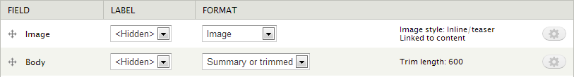

For sidebar teasers:

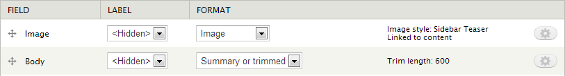

For focus on teasers:

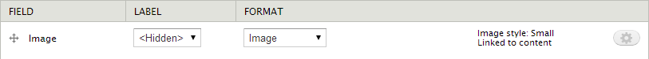

For the 'News listing item' content type you will need to set the display settings to only show the (summary) body. This would typically look like:

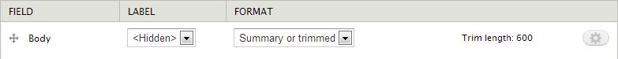

If you are using a `field_link` provided by the [Link feature](https://github.com/misd-service-development/drupal-feature-link) you also need to make your link field available (it doesn't matter what format setting you use). The teaser will then link to your custom URL rather than to the node.

Creating a list of horizontal teasers
-------------------------------------

To create a list of sidebar teasers produced by a view, have a block with the following format options:

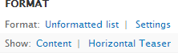

The view block then needs to be set to appear on the appropriate page(s) in the 'Content' region.

Creating a list of vertical teasers
-----------------------------------

To create a list of vertical teasers produced by a view, have a block with the following format options:

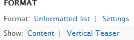

Then change the format settings to:

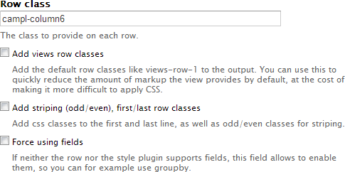

This will create 2 columns. For 3 columns, for example, set the row class to `campl-column4`.

Finally, set CSS class in the Advanced section to:

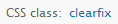

The view block then needs to be set to appear on the appropriate page(s) in the 'Content' region.

Creating a list of sidebar teasers
----------------------------------

To create a list of sidebar teasers produced by a view, have a block with the following format options:

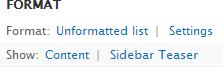

The view block then needs to be set to appear on the appropriate page(s) in the 'Sidebar' region.

Creating a list of focus on teasers
-----------------------------------

To create a list of focus on teasers produced by a view, have a block with the following format options:

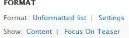

Then change the format settings to:

This will create 2 columns. For 3 columns, for example, set the row class to `campl-column4`.

Finally, set CSS class in the Advanced section to:

The view block then needs to be set to appear on the appropriate page(s) in the 'Content' region.

Creating a list of news items
-----------------------------

To create a list of news items produced by a view, have a block with the following format options:

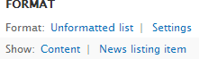

The view block then needs to be set to appear on the appropriate page(s) in the 'Sub-content' region.

Creating a page of news items
---------------------------

For a page of news items you should use the [horizontal teaser](https://github.com/misd-service-development/drupal-feature-teasers) node view mode.
